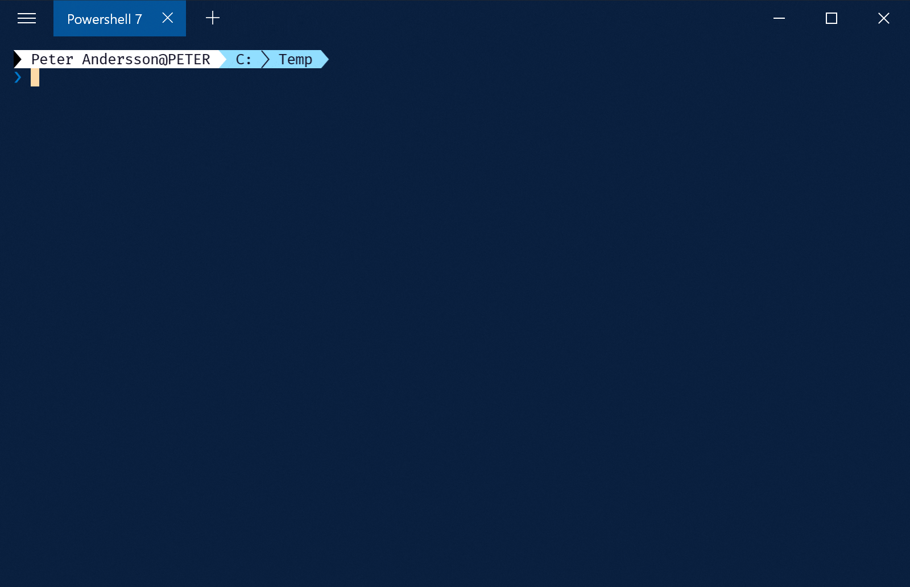

1. Install **PowerShell 7** `winget install --id=Microsoft.PowerShell  -e`
2. Install [**Fluent Terminal**](https://www.microsoft.com/en-us/p/fluent-terminal/9p2krlmfxf9t?activetab=pivot:overviewtab)
3. Install nerd font of choice mine is **FuraCode Nerd Font**
   1. [Open releases on github](https://github.com/ryanoasis/nerd-fonts/releases/)
   2. Download font of choice
   3. Download `Hack`
   4. Download `HeavyData`
   5. [Install all of them!](https://github.com/ryanoasis/nerd-fonts#font-installation)
4. Configure Fluent Terminal
   1. Change font under Terminal to your font of choice
   2. Add **PowerShell 7** Profile to Fluent Terminal

| Name                      | Value                                    |
| ------------------------- | ---------------------------------------- |
| Name                      | `Powershell 7`                           |
| Shell executable location | `C:\Program Files\PowerShell\7\pwsh.exe` |

5. Install **oh-my-posh** `Install-Module oh-my-posh -Scope CurrentUser`
2. Update **PSReadLine** to latest PreRelease build
   1. Shutdown all instances of powershell 7, run `tasklist | find "pwsh"` to verify
   2. Run `pwsh -noprofile -command "Install-Module PSReadLine -Force -SkipPublisherCheck -AllowPrerelease"`
3. Install **posh-git** `Install-Module posh-git -Scope CurrentUser -Force`
4. Configure Powershell
   1. Enable **PSReadLine** ``Add-Content $profile "Import-Module PSReadLine`nSet-PSReadLineOption -predictionsource history"`nSet-PSReadLineOption -Colors @{ InlinePrediction = '#8bab5c'}``
   2. Enable **posh-git** `Add-Content $profile "Import-Module posh-git"`
   3. [Find what theme you want to use](https://ohmyposh.dev/docs/themes) i use [**paradox**](https://ohmyposh.dev/docs/themes#paradox)
   4. Enable **oh-my-posh** theme `Add-Content $profile "Set-PoshPrompt -Theme Paradox"`
5.  Install **gsudo** `winget install --id=gerardog.gsudo  -e`
6.  Restart **Fluent terminal** by killing right clickling on the tray icon and selecting **Exit**
7.  Start **Fluent terminal** and start a powershell 7 terminal and you should be met by something like this:

